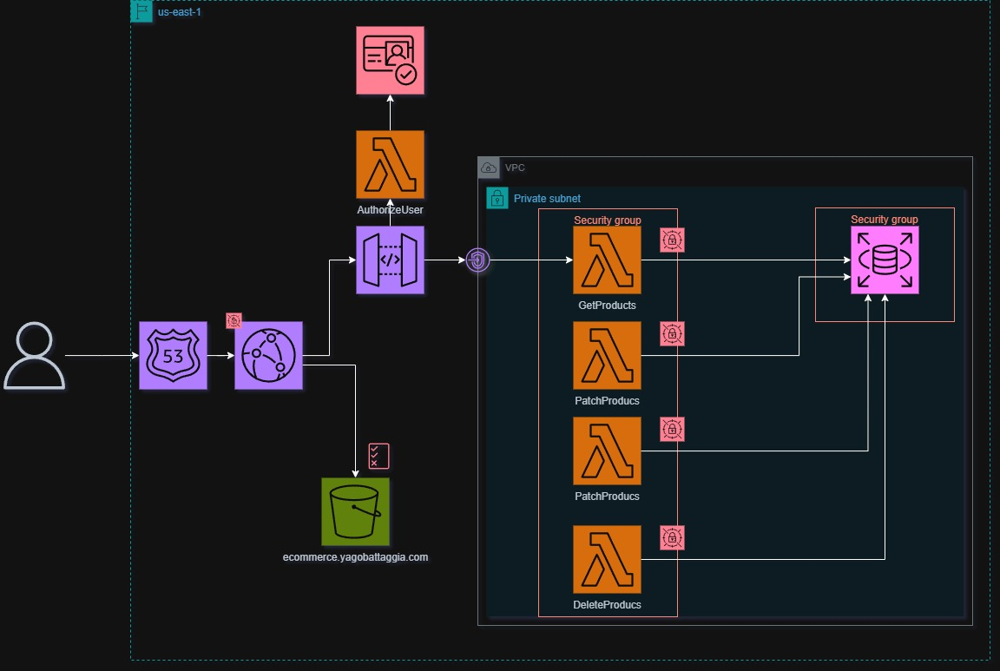

# e-commerce-case
Este repositório tem como objetivo a resolução de um caso de uso.

# O Caso
## Introdução
> Você é um engenheiro de software em uma startup de tecnologia que desenvolve uma plataforma de ecommerce.
A empresa decidiu expandir suas operações e está desenvolvendo um novo módulo para gerenciar o inventário
dos produtos.
Sua tarefa é desenvolver uma parte desse sistema, especificamente o backend para gerenciar o inventário
usando uma API RESTful, juntamente com uma interface de usuário básica usando AngularJS.
Além disso, a empresa está migrando sua infraestrutura para a AWS, então você precisa implantar sua solução na
AWS.

## Requisitos Técnicos
 - Neste projeto, a infraestutura deverá ser implementada na Amazon Web Services (AWS)
 - O Front-end deverá ser realizado em AngularJS, de preferência
 - Autenticação básica com tokens JWT deverá ser implementada
 - Elaborar a documentação técnica e de tomada de decisão

## Protótipo
A primeira etapa para o desenvolvimento do projeto é idealizar o protótipo, onde a jornada usuário deverá ser planejada considerando as melhores práticas de interfaces.

Imagem dos wireframes -->

Com a jornada do usuário definida, a próxima etapa é a integração com a identidade visual. Nesta etapa, a interface ganha vida com cores, imagens, botões e textos.

Imagem do protótipo -->


## Arquitetura
Após a definição do escopo do produto e a jornada do usuário em que o sistema deverá ser planejado, a próxima etapa é a definição da arquitetura a ser utilizada.

### Arquitetura de Soluções
A arquitetura da solução é essencial para a identificação de possíveis riscos a serem considerados durante o desenvolvimento, otimização de custos e boas práticas de segurança. 

Abaixo temos a arquitetura utilizada para o desenvolvimento. Essa arquitetura pode ser melhorada para garantir as melhores práticas de uma aplicação.


`Arquitetura PoC`

Melhorias na arquitetura para um projeto robusto:
- Banco de dados em multi-az
- CloudFront e WAF (Web Application Firewall) para entrega do site estático e APIs em HTTPS
- Implementação de um IDP (Identity Provider), podendo ser o AWS Cognito ou outro SSO
- Lambda Authorizer para validação de permissões

<!-- Imagem Arquitetura final -->

`Arquitetura com Evoluções`

### Arquitetura da Aplicação
A aplicação será serverless, com lambdas separadas por Método HTTP. Com isso, obtemos melhor escalabilidade,
melhoria na manutenção, melhor observabilidade no CloudWatch para debug e Cold Starts mais rápidos

Para o compartilhamento de código entre lambdas, pode-se utilizar o Model e Repository, que
centralizarão as classes de Produtos e a interface para criação, remoção, atualização e requisição de produtos.

```sh
|-/infra
    |- /src
        |- /Shared
            |- /Models
                |- product_model.py
            |- /Repo
                |- product_repo.py
        |- /Utils
            |- __init__.py
            |- config.py # Funções comparilhadas para 
                         # comunicação com o banco de dados
        |- /PyMySQL # Biblioteca para conexão como o banco de dados
        |- /PyPika # Query builder
        |- ecommerceDeleteProducts.py
        |- ecommerceGetProducts.py
        |- ecommercePostProducts.py
        |- ecommercePutProducts.py
        
```

#### Terraform
Toda a infraestrutura apresentada na `Arquitetura PoC` foi provisionada utilizando Terraform, permitindo melhor controle do que será provisionado, versionamento da infraestrutura e utilização de módulos.

    ❕ Os arquivos do terraform estão disponíveis no link abaixo: 

[Visualiza IaC](infra/)

<details>
  <summary>Clique aqui para visualizar o passo a passo para rodar o Terraform</summary>

#### 1. Instalando Terraform
Siga o passo a passo do [Terraform](https://developer.hashicorp.com/terraform/tutorials/aws-get-started/install-cli) para a instalação da ferramenta
#### 2. Clonando o Repositório
Utilizando o git, execute o comando
  ```sh 
  git clone <link do repositório>
  ```
#### 3. Acessando a pasta do terraform
Utilizando o terminal (ou cmd), digite:
  ```sh 
  cd ecommerce/infra
  ```
  
#### 4. Inicializando e planejando a implementação
Utilizando o terminal (ou cmd), digite:
  ```sh 
  terraform init
  ```
Após a inicialização do terraform, devemos planejar a execução a ser realizada
  ```sh 
  terraform plan
  ```

Nesta etapa, o terraform exibirá o que será implementado na AWS. Confira com cuidado!

#### 4. Implementando infraestrutura
```sh 
  terraform apply
  ```
O terraform exibirá o que foi planejado e solicitará a confirmação da implementação.

</details>

### Custo previsto
Para a obtenção do custo previsto, a extensão infracost pode auxiliar. Também é possível configurar a arquitetura proposta na [calculadora aws](https://calculator.aws)

O custo previsto para o projeto em um mês, no ambiente de produção é:


Para ambientes de Dev e HML é possível implementa o desligamento automático da instância RDS fora do horário comercial, ou utilizar Aurora Serverless para otimizar custos. 


### Diagrama de Relacionamentos do Banco de Dados
O Banco de dados de um E-commerce é complexo, por possuir muitas relações e personalização.
Para contemplar este caso, temos uma tabela de categorias, das quais podem possuir diversos produtos.

Cada produto pode possuir diversos tipos de cores e tamanhos, portanto, a tabela product_item é responsável por cada tipo de variação. Essa tabela possui relacionamento com a tabela de imagens, cores e tamanhos.

    ❕ O arquivo SQL com a criação de todas as tabelas e a inclusão de um produto está disponível no link abaixo: 
    
[Visualizar Arquivo SQL](database/create_products.sql)


# APIs
A collection com todos os métodos pode ser acessada no link [Visualizar collection](/docs/Insomnia_collection.json)
## Endpoints

### 1. Adicionar Produto

**Endpoint:** `POST /api/products`

**Descrição:** Adiciona um novo produto ao catálogo.

**Payload:**

```json
{
  "category_name": "Coleiras",
  "category_description": "Coleiras e Itens de Segurança",
  "product_name": "Peitoral Pet para cães American pets",
  "product_description": "Promove passeios mais confortáveis para o seu pet",
  "variants": [
    {
      "color_name": "Azul Royal",
      "color_hex": "#004680",
      "stock_qty": 20,
      "size_name": "P",
      "price": "R$ 14,00",
      "sale_price": "R$ 10,00"
    }
  ]
}
```
**Resposta**

Este método retornará `201 Created` ao realizar a criação do produto com sucesso!
```json
{
	"Data": "Produto inserido com sucesso"
}
```

### 2. Consultar Produto

**Endpoint:** `GET /api/products?id={product_id}`

**Descrição:** Consulta um ou todos os produtos.

**Resposta**

Este método retornará `200 Ok` ao retornar um produto!
```json
{
  "category_name": "String",
  "category_description": "String",
  "product_name": "String",
  "product_description": "String",
  "variants": [
    {
      "color_id": "String",
      "color_name": "String",
      "color_hex": "String",
      "stock_qty": "int",
      "size_id": "int",
      "size_name": "String",
      "price": "String",
      "sale_price": "String"
    }
  ]
}
```

Este método retornará `404 Not Found` caso não tenha nehum produto com o id solicitado, ou não possuir nenhum produto na base de dados!

```json
{
	"Data": "Produto não encontrado"
}
```

### 3. Atualizar Produto

**Endpoint:** `PUT /api/products`

**Descrição:** Altera um produto. Este método atualiza todos os campos do produto.


**Payload:**
```json
{
  "product_id": "String",
  "category_name": "String",
  "category_description": "String",
  "product_name": "String",
  "product_description": "String",
  "variants": [
    {
      "color_id": "String",
      "color_name": "String",
      "color_hex": "String",
      "stock_qty": "int",
      "size_id": "int",
      "size_name": "String",
      "price": "String",
      "sale_price": "String"
    }
  ]
}
```
Este método retornará `200 Ok` ao atualizar um produto!

**Resposta**

```json
{
	"Data": "Produto atualizado com sucesso"
}
```

### 3. Excluir Produto

**Endpoint:** `DELETE /api/products`

**Descrição:** Remove um produto da base de dados

**Payload**
```json
{
  "product_id": "int"
}
```

**Resposta**

Este método retornará `204 No Content` ao remover um produto!

[Referência HTTP Status](https://developer.mozilla.org/en-US/docs/Web/HTTP/Status/204)

